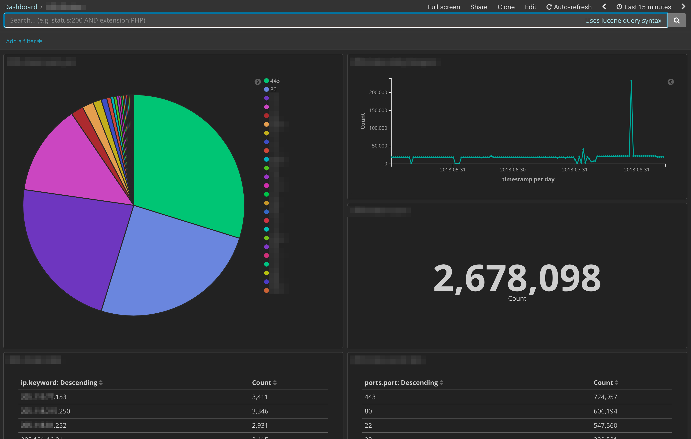

##Port-Crawler-Py




## Quick Installation on Ubuntu, CentOS/RHEL:

### Run the install.sh script automatically:

The `install.sh` script has been provided to simplify installing dependencies. It installs Masscan, Elasticsearch and Kibana, does minimal configuration of ES + Kibana and starts them

`curl https://raw.githubusercontent.com/heywoodlh/Port-Crawler-Py/master/install.sh | bash`

*Note: Please make sure that before running this script that you read the install script to make sure it doesn't do anything nefarious or that it won't impact your current system negatively. You solely are responsible for security and well-being of your device. If you are not sure, refer to the manual installation section.*


## Running port-crawler.py

Help message:


```
❯ /opt/Port-Crawler-Py/port-crawler.py --help
usage: port-crawler.py [-h] [-c CONFIG] [--ip IP [IP ...]] [-r RATE]
                       [-p PORTS [PORTS ...]] [-i INDEX_PREFIX] [--test]

Port crawling script

optional arguments:
  -h, --help            show this help message and exit
  -c CONFIG, --config CONFIG
                        masscan config file
  --ip IP [IP ...]      IP(s) to scan
  -r RATE, --rate RATE  masscan rate
  -p PORTS [PORTS ...], --ports PORTS [PORTS ...]
                        Port(s) to scan
  -i INDEX_PREFIX, --index_prefix INDEX_PREFIX
                        Prefix of index
  --test                do not upload for testing
```


Edit the config file at `/opt/Port-Crawler-Py/masscan.conf` to reflect the configuration parameters you'd like `masscan` to use (IP addresses, ports, etc). Run `port-crawler.py` using the config file:

```
sudo /opt/Port-Crawler-Py/port-crawler.py --config /opt/Port-Crawler-Py/masscan.conf --index_prefix portscans
```


Example command not using a config file:

```
sudo /opt/Port-Crawler-Py/port-crawler.py --rate 1000 --ip 192.168.0.1 192.168.0.10 192.168.2.0/24 --ports 0-1024 3389 4786 3306 5432 1433 8080 11211 7001 --index_prefix portscans
```


Set the scan to repeat itself on a regular basis -- at 1:00 a.m. every day -- with a cronjob (`sudo crontab -e`), changing the IP addresses and ports as you'd like:

```
0 1 * * * /opt/Port-Crawler-Py/port-crawler.py --config /opt/Port-Crawler-Py/masscan.conf --index_prefix portscans
```


## Configuring Kibana:

### Access Kibana:

You can go to http://hostname:5601 of your server and access Kibana. 


### Set up an index pattern:

In Kibana go to Management > Index Patterns > Create index pattern.

If you used an index prefix of 'portscans' in `port-crawler.py` (or didn't set an index pattern explicitly), set the index pattern to be 'portscans\*'. 

*Note: Data must be in Elasticsearch prior to setting up the index pattern to verify it matches the data in Elasticsearch. So run `port-crawler.py` prior to setting up the index pattern.*


### Set up default visualizations and dashboard:

In this repository is a copy of a default Kibana dashboard called `kibana-export.json` and visualizations that can be used to visualize the results of `port-crawler.py`'s `masscan` results.

In order to import it go to Management > Saved Objects > Import. Download `kibana-export.json` to the machine that you are accessing the Kibana interface from and select `kibana-export.json` to import the dashboard and visualizations.


## Install Elasticsearch, Masscan, Kibana, Port-Crawler-Py and dependencies manually on Ubuntu:

### Install Java:

```
sudo apt-get update
sudo apt-get install openjdk-8-jdk -y
```


### Elastic repository install:

```
wget -qO - https://artifacts.elastic.co/GPG-KEY-elasticsearch | sudo apt-key add -
echo "deb https://artifacts.elastic.co/packages/6.x/apt stable main" > /etc/apt/sources.list.d/elastic-6.x.list
```


### Elasticsearch install:

```
sudo apt-get update
sudo apt-get install elasticsearch -y
sudo sed -i 's/#cluster.name: my-application/cluster.name: port-crawler/g' /etc/elasticsearch/elasticsearch.yml
sudo sed -i 's/#network.host: 192.168.0.1/network.host: 127.0.0.1/g' /etc/elasticsearch/elasticsearch.yml
sudo systemctl enable elasticsearch.service
sudo systemctl start elasticsearch.service
```


### Kibana install:

```
IP_OR_HOSTNAME='0.0.0.0' ## << Change this to equal the IP/hostname Kibana will be served on
sudo apt-get install kibana -y
sudo sed -i 's/#server.port: 5601/server.port: 5601/g' /etc/kibana/kibana.yml
sudo sed -i 's/#server.host: "localhost"/server.host: '"$IP_OR_HOSTNAME"'/g' /etc/kibana/kibana.yml
sudo systemctl enable kibana.service
sudo systemctl restart kibana.service
```


### Masscan install:

```
sudo apt-get install git gcc make clang libpcap-dev -y
sudo chown -R "$USER:$USER" /opt
cd /opt
git clone https://github.com/robertdavidgraham/masscan
cd masscan
make
sudo cp bin/masscan /usr/bin/
```


### Install Python3:

```
sudo apt-get install python3 python3-pip -y
```


### Install Port-Crawler-Py:

```
sudo chown -R "$USER":"$USER" /opt/
cd /opt/
git clone https://github.com/heywoodlh/Port-Crawler-Py
cd Port-Crawler-Py/
sudo pip3 install -r /opt/Port-Crawler-Py/requirements.txt
```
